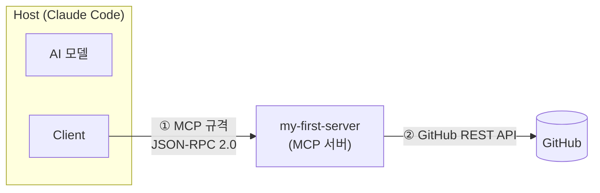
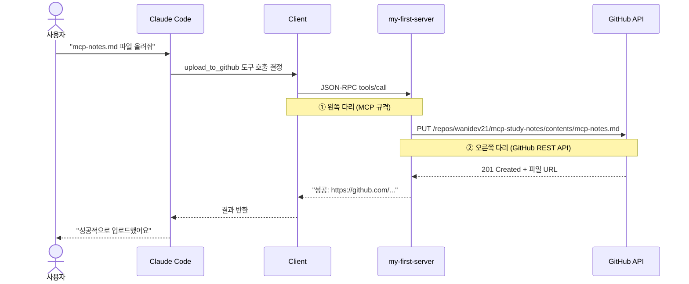

# MCP(Model Context Protocol) 학습 노트

> wanidev21 · 2026-06-03  
> Ubuntu 서버에서 Python MCP 서버를 직접 구현하고 GitHub에 파일을 올리기까지

---

## 1. MCP란?

Anthropic이 2024년 11월 공개한 오픈 프로토콜.  
**AI 모델이 외부 도구·데이터·서비스에 연결되는 방식을 표준화한 규격**이다.

이전에는 AI 앱 M개 × 도구 N개 = **M×N개**의 맞춤 연동 코드가 필요했다.  
MCP는 연결 규격을 하나로 통일해 **M+N**으로 줄인다.  
→ 도구를 MCP 서버로 한 번만 만들면 어떤 MCP 호환 AI든 바로 쓸 수 있다.

---

## 2. 핵심 구조



| 역할 | 위치 | 하는 일 |
|------|------|---------|
| **Host** | 사용자가 쓰는 앱 | Claude Code, Cursor 등. AI 모델과 Client를 포함 |
| **Client** | Host 안 | 하나의 MCP 서버와 1:1 연결 관리. Host에 내장되어 있어 직접 만들 필요 없음 |
| **Server** | 외부 프로그램 | 기존 서비스/API를 MCP 형식으로 감싸는 변환기. **우리가 만드는 것** |

**통신은 두 다리로 나뉜다**
- `①` Client ↔ MCP 서버: **MCP 규격(JSON-RPC 2.0)** — 표준화된 구간
- `②` MCP 서버 ↔ 외부 서비스: **각 서비스의 원래 API** — 서버가 통역하는 구간

### Server가 제공하는 것 (Primitives)

| 종류 | 통제 주체 | 설명 |
|------|----------|------|
| **Tools** | AI 모델 | AI가 직접 호출하는 실행 함수. 이번에 우리가 만든 것 |
| **Resources** | Host 앱 | 읽기 전용 데이터 (파일, DB 조회 등) |
| **Prompts** | 사용자 | 재사용 가능한 프롬프트 템플릿 |

---

## 3. 우리가 만든 MCP 서버

### 전체 요청 흐름

사용자가 "파일 올려줘"라고 하면 실제로 이런 일이 벌어진다.



AI가 도구를 쓸 때 Claude Code 화면에 `mcp__my-first-server__upload_to_github` 형태로 표시된다.  
`mcp__서버이름__도구이름` 형식으로 어느 서버의 어느 도구를 호출하는지 추적할 수 있다.

---

### 3-1. 환경 설정

```bash
mkdir ~/mcp-notes && cd ~/mcp-notes

python3 -m venv .venv       # 가상환경: pip 패키지가 시스템에 영향 안 주도록 격리
source .venv/bin/activate   # 가상환경 활성화 (프롬프트에 (.venv) 표시됨)

pip install mcp             # MCP Python SDK. FastMCP 포함
pip install httpx           # GitHub API 호출에 쓸 HTTP 클라이언트
```

---

### 3-2. 서버 코드 (server.py)

```python
import os, base64, httpx
from mcp.server.fastmcp import FastMCP

# ─────────────────────────────────────────────
# 서버 선언
# FastMCP: JSON-RPC 처리를 모두 담당하는 공식 SDK
# 괄호 안 이름이 Claude Code에서 서버를 식별하는 이름이 된다
# ─────────────────────────────────────────────
mcp = FastMCP("my-first-server")


# ─────────────────────────────────────────────
# 도구 선언: @mcp.tool() 데코레이터
# 이 데코레이터 하나로 평범한 Python 함수가 AI가 호출할 수 있는 MCP Tool이 된다
# docstring이 중요 → Claude가 이 도구를 언제, 어떻게 써야 하는지 판단하는 근거
# ─────────────────────────────────────────────
@mcp.tool()
def add(a: int, b: int) -> int:
    """두 숫자를 더한다"""
    return a + b


@mcp.tool()
def reverse_text(text: str) -> str:
    """글자를 거꾸로 뒤집는다"""
    return text[::-1]


@mcp.tool()
def upload_to_github(path: str, content: str, message: str = "Update via MCP") -> str:
    """GitHub 레포에 파일을 올리거나 수정한다. path=레포 안 파일경로, content=파일내용"""

    # 환경변수에서 읽는다 → 토큰을 코드에 하드코딩하면 GitHub에 올렸을 때 노출 위험
    token = os.environ.get("GITHUB_TOKEN")
    repo  = os.environ.get("GITHUB_REPO")   # 형식: "사용자명/레포명"
    if not token or not repo:
        return "GITHUB_TOKEN / GITHUB_REPO 환경변수가 설정 안 됐어요."

    url = f"https://api.github.com/repos/{repo}/contents/{path}"
    headers = {
        "Authorization": f"Bearer {token}",
        "Accept": "application/vnd.github+json"
    }

    # ② 오른쪽 다리: GitHub REST API 호출 시작
    # 파일이 이미 존재하면 수정(Update), 없으면 생성(Create)
    # GitHub API는 파일 수정 시 현재 파일의 sha 값을 반드시 요구한다
    sha = None
    r = httpx.get(url, headers=headers)
    if r.status_code == 200:
        sha = r.json()["sha"]   # 파일이 있으면 sha를 미리 받아둔다

    # GitHub API는 파일 내용을 base64로 인코딩해서 받는다
    body = {
        "message": message,
        "content": base64.b64encode(content.encode()).decode()
    }
    if sha:
        body["sha"] = sha       # 수정 시에는 sha를 같이 보내야 한다

    resp = httpx.put(url, headers=headers, json=body)
    if resp.status_code in (200, 201):
        return f"성공: {resp.json()['content']['html_url']}"
    return f"실패({resp.status_code}): {resp.text[:200]}"


# ─────────────────────────────────────────────
# 서버 실행
# mcp.run() 기본값: stdio transport
# → Claude Code가 이 프로세스를 직접 실행하고 stdin/stdout으로 통신
# 주의: 도구 함수 안에서 print() 사용 금지 (stdout이 MCP 통신 채널이라 충돌)
#       디버그 출력이 필요하면 반드시 sys.stderr 사용
# ─────────────────────────────────────────────
if __name__ == "__main__":
    mcp.run()
```

---

### 3-3. Claude Code에 서버 등록

```bash
claude mcp add-json my-first-server '{
  "type":    "stdio",
  "command": "/root/mcp-notes/.venv/bin/python",
  "args":    ["/root/mcp-notes/server.py"],
  "env": {
    "GITHUB_TOKEN": "github_pat_...",
    "GITHUB_REPO":  "wanidev21/mcp-study-notes"
  }
}'
```

각 필드가 하는 일:

| 필드 | 값 | 의미 |
|------|-----|------|
| `type` | `"stdio"` | 같은 PC에서 프로세스로 실행하는 방식 |
| `command` | 가상환경의 python 경로 | 시스템 python 대신 venv의 python을 써야 mcp 패키지를 찾는다 |
| `args` | server.py 절대 경로 | 실행할 서버 파일 |
| `env` | 토큰, 레포명 | 서버 프로세스에 환경변수로 주입됨. `~/.claude.json`에 저장 |

설정은 `~/.claude.json`에 저장된다. `claude mcp list`로 연결 상태를 확인한다.

```bash
claude mcp list
# → my-first-server: /root/... - ✓ Connected  ← 이게 뜨면 성공
```

등록 직후 Claude Code가 서버에 `tools/list`를 호출해서 도구 목록을 자동으로 가져온다.  
이것이 Discovery(발견) 과정이며, 이 시점에 `add`, `reverse_text`, `upload_to_github` 세 도구가 등록된다.

---

### 3-4. GitHub 토큰(PAT) 발급

경로: GitHub → Settings → Developer settings → Personal access tokens → Fine-grained tokens

필요한 권한:
- Repository access: **Only select repositories** → 해당 레포만 선택
- Permissions → Contents: **Read and write**

보안 주의:
- 토큰을 `server.py`에 직접 쓰지 않는다 (레포에 올리면 자동으로 무효화됨)
- `claude mcp add-json`의 `env` 필드로 넘기면 `~/.claude.json`에만 저장된다
- 토큰이 노출되면 즉시 Revoke 후 재발급

---


---

## 4. 직접 만든 서버를 통해 본 MCP의 본질

### 공식 GitHub MCP 서버와의 차이

| | 우리가 만든 서버 | 공식 GitHub MCP 서버 |
|---|---|---|
| 도구 수 | 3개 (add, reverse_text, upload_to_github) | 수십 개 (PR, 이슈, 브랜치, 검색...) |
| 목적 | MCP 구조 학습 | 실무 GitHub 자동화 |
| 구현 | Python 50줄 | Go 바이너리 |
| 유지보수 | 직접 | GitHub이 관리 |
| **MCP 구조** | **동일** | **동일** |

**둘의 차이는 "기능의 범위"뿐이다. MCP 관점에서 구조는 완전히 같다.**
양쪽 모두 "GitHub API를 MCP 형식으로 감싼 변환기"이며, 왼쪽 다리(MCP 규격)와 오른쪽 다리(GitHub API)의 구조가 동일하다.

---

### 우리 서버의 코드 한 줄 → MCP 본질

**① `@mcp.tool()` → Tool Primitive 선언**

함수 하나 = Tool 하나. 이 데코레이터가 MCP의 Tool Primitive를 만드는 행위다.
FastMCP가 함수를 AI가 호출할 수 있는 표준 형식(Tool Schema)으로 자동 변환한다.

**② Docstring → AI의 도구 선택 기준**

MCP에서 Tool의 `description` 필드다.
AI는 사용자 요청과 이 설명을 매칭해서 어떤 도구를 쓸지 결정한다.
AI는 구현 코드(httpx, base64 등)를 볼 수 없고 오직 이 설명만 본다.
→ **docstring을 잘 써야 AI가 도구를 제대로 쓴다.**

**③ Type hints → Tool의 inputSchema**

AI가 도구를 부를 때 "어떤 인자를 어떤 타입으로 넣어야 하는지"를 알려주는 schema다.
AI가 실제 값(파일명, 내용, 커밋 메시지)을 채워 넣는 기준이 된다.
FastMCP가 타입힌트를 읽어서 JSON Schema로 자동 변환한다.

예: `upload_to_github(path: str, content: str, message: str = "Update via MCP")`
→ AI는 "path는 문자열, content는 문자열, message는 선택사항"임을 이 정보만으로 안다.

**④ `return "성공: url"` → ToolResult**

함수의 반환값이 곧 MCP의 ToolResult다.
이 값이 JSON-RPC로 포장되어 Client → AI로 돌아오고,
AI가 사용자에게 최종 답변을 만드는 재료로 쓴다.

**⑤ `mcp.run()` → Transport 선언**

stdio transport로 서버를 실행한다는 선언.
Claude Code가 이 프로세스를 직접 띄우고 stdin/stdout으로 JSON-RPC 메시지를 주고받는다.
`transport="streamable-http"`로 바꾸면 원격 HTTP 서버가 된다.

**⑥ Client ↔ 서버 구간 → 왼쪽 다리 (표준화된 구간)**

JSON-RPC 2.0 형식. 어떤 서버든 항상 같은 형식으로 요청하고 결과를 받는다.

```json
{ "method": "tools/call", "params": { "name": "upload_to_github", "arguments": { "path": "mcp-notes.md", "content": "..." } } }
```

이 구간이 표준화되어 있기 때문에 어떤 AI 호스트든 어떤 MCP 서버든 별도 작업 없이 연결된다.
→ **M×N을 M+N으로 줄이는 핵심.**

**⑦ `httpx.get / httpx.put` → 오른쪽 다리 (서비스별 비표준)**

각 서비스의 원래 API를 그대로 사용한다.
GitHub이면 REST API + base64 인코딩 + sha,
Slack이면 Slack API, DB면 SQL.
이 구간이 서비스마다 달라서 MCP 서버(변환기)가 존재하는 이유다.
→ **오른쪽 다리의 다양성을 왼쪽의 표준으로 흡수하는 것이 서버의 역할.**

**⑧ `os.environ.get("GITHUB_TOKEN")` → MCP의 보안 패턴**

토큰을 코드에 직접 넣지 않고 Host가 환경변수로 주입한다.
`claude mcp add-json`의 `env` 필드 → `~/.claude.json`에 저장 → 서버 실행 시 주입.
코드를 GitHub에 올려도 토큰이 노출되지 않는 이유다.

**⑨ Discovery (tools/list) → 자동 도구 등록**

`@mcp.tool()`로 선언한 함수들이 연결 즉시 Host에 자동으로 노출된다.
Claude Code가 연결 시 "너 뭐 할 수 있어?"라고 물어보고 목록을 받아온다.
새 도구를 추가하면 재등록 없이 서버 재시작만 해도 AI가 새 도구를 인식한다.

---

### 결론

공식 GitHub MCP 서버는 우리가 만든 것과 구조가 완전히 같다.
차이는 오른쪽 다리에서 GitHub API를 얼마나 많이 활용하느냐뿐이다.

```
MCP의 본질 = 왼쪽 다리를 표준화해서 M×N → M+N으로 줄이는 것

우리 서버 50줄도 이 본질을 완전히 구현하고 있다.
공식 서버는 오른쪽 다리(GitHub API 활용)를 더 많이 구현했을 뿐이다.
```

직접 만들어봤기 때문에 공식 서버 코드를 봐도 구조가 보이고,
work2 같은 자체 서비스를 MCP 서버로 만들 때도 같은 패턴을 그대로 쓸 수 있다.


---

## 5. 핵심 요약

```
MCP 서버 = 기존 API를 MCP 형식으로 감싼 변환 프로그램

@mcp.tool() 데코레이터 하나 → 일반 Python 함수가 AI 호출 가능 도구로 변환

왼쪽 다리 (Client ↔ 서버): MCP 규격으로 표준화 → 어떤 AI든 연결 가능
오른쪽 다리 (서버 ↔ 외부): 각 서비스의 원래 API → 서버가 통역

개발자가 만드는 것: 서버(도구)
Host에 이미 있는 것: Client (Claude Code가 내장)
```

---

*구현 레포: [wanidev21/mcp-study-notes](https://github.com/wanidev21/mcp-study-notes)*
