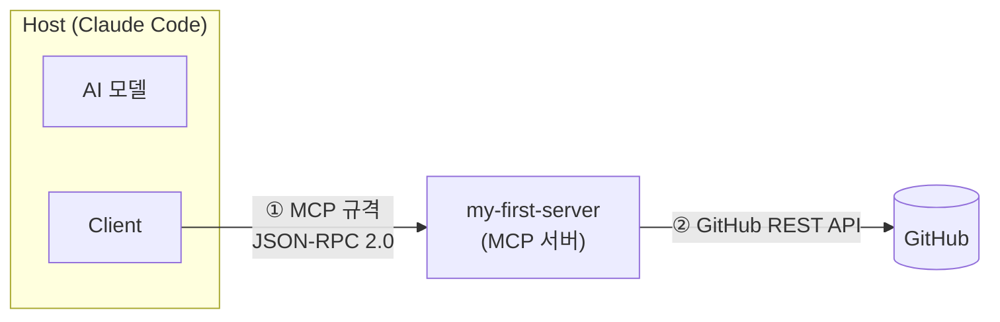
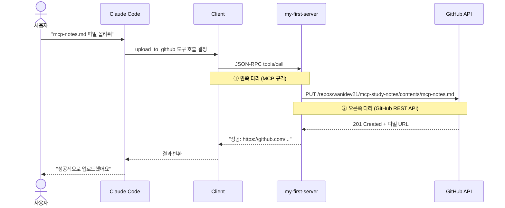

# MCP(Model Context Protocol) 학습 노트

> 작성: wanidev21 · 2026-06-03
> Ubuntu 환경에서 Python으로 MCP 서버를 구현하고 GitHub 파일 업로드를 자동화한 과정을 정리한 문서

---

## 1. MCP란?

Anthropic이 2024년 11월 공개한 오픈 프로토콜.
**AI 모델이 외부 도구·데이터·서비스에 연결되는 방식을 표준화한 규격**이다.

이전에는 AI 앱 M개 × 도구 N개 = **M×N개**의 맞춤 연동 코드가 필요했다.
MCP는 연결 규격을 하나로 통일해 **M+N**으로 줄인다.
도구를 MCP 서버로 한 번만 만들면 어떤 MCP 호환 AI든 바로 활용할 수 있다.

---

## 2. 핵심 구조



| 역할 | 위치 | 하는 일 |
|------|------|---------|
| **Host** | 사용자가 사용하는 앱 | Claude Code, Cursor 등. AI 모델과 Client를 포함 |
| **Client** | Host 안 | 하나의 MCP 서버와 1:1 연결 관리. Host에 내장되어 있어 별도 구현 불필요 |
| **Server** | 외부 프로그램 | 기존 서비스/API를 MCP 형식으로 감싸는 변환기. 개발자가 구현하는 영역 |

**통신은 두 다리로 나뉜다**
- `①` Client ↔ MCP 서버: **MCP 규격(JSON-RPC 2.0)** — 표준화된 구간
- `②` MCP 서버 ↔ 외부 서비스: **각 서비스의 원래 API** — 서버가 통역하는 구간

### Server가 제공하는 것 (Primitives)

| 종류 | 통제 주체 | 설명 |
|------|----------|------|
| **Tools** | AI 모델 | AI가 직접 호출하는 실행 함수 |
| **Resources** | Host 앱 | 읽기 전용 데이터 (파일, DB 조회 등) |
| **Prompts** | 사용자 | 재사용 가능한 프롬프트 템플릿 |

---

## 3. MCP 서버 구현

### 전체 요청 흐름

파일 업로드를 요청하면 실제로 다음과 같이 처리된다.



AI가 도구를 호출할 때 Claude Code 화면에 `mcp__서버이름__도구이름` 형태로 표시된다.
예: `mcp__my-first-server__upload_to_github`

---

### 3-1. 환경 설정

```bash
mkdir ~/mcp-notes && cd ~/mcp-notes

python3 -m venv .venv       # 가상환경: 패키지가 시스템에 영향 주지 않도록 격리
source .venv/bin/activate   # 가상환경 활성화

pip install mcp             # MCP Python SDK (FastMCP 포함)
pip install httpx           # GitHub API 호출용 HTTP 클라이언트
```

---

### 3-2. 서버 코드 (server.py)

```python
import os, base64, httpx
from mcp.server.fastmcp import FastMCP

# ─────────────────────────────────────────────
# 서버 선언
# FastMCP: JSON-RPC 처리를 모두 담당하는 공식 SDK
# 괄호 안 이름이 Claude Code에서 서버를 식별하는 이름이 된다
# ─────────────────────────────────────────────
mcp = FastMCP("my-first-server")


# ─────────────────────────────────────────────
# 도구 선언: @mcp.tool() 데코레이터
# 이 데코레이터 하나로 일반 Python 함수가 AI가 호출할 수 있는 MCP Tool이 된다
# docstring → AI가 이 도구를 언제, 어떻게 써야 하는지 판단하는 근거
# ─────────────────────────────────────────────
@mcp.tool()
def add(a: int, b: int) -> int:
    """두 숫자를 더한다"""
    return a + b


@mcp.tool()
def reverse_text(text: str) -> str:
    """글자를 거꾸로 뒤집는다"""
    return text[::-1]


@mcp.tool()
def upload_to_github(path: str, content: str, message: str = "Update via MCP") -> str:
    """GitHub 레포에 파일을 올리거나 수정한다. path=레포 안 파일경로, content=파일내용"""

    # 환경변수에서 인증 정보를 읽는다 (코드에 직접 작성 시 노출 위험)
    token = os.environ.get("GITHUB_TOKEN")
    repo  = os.environ.get("GITHUB_REPO")   # 형식: "사용자명/레포명"
    if not token or not repo:
        return "GITHUB_TOKEN / GITHUB_REPO 환경변수가 설정되지 않았습니다."

    url = f"https://api.github.com/repos/{repo}/contents/{path}"
    headers = {
        "Authorization": f"Bearer {token}",
        "Accept": "application/vnd.github+json"
    }

    # 파일이 이미 존재하면 수정(Update), 없으면 생성(Create)
    # GitHub API는 파일 수정 시 현재 파일의 sha 값을 반드시 요구한다
    sha = None
    r = httpx.get(url, headers=headers)
    if r.status_code == 200:
        sha = r.json()["sha"]

    # GitHub API는 파일 내용을 base64로 인코딩하여 전송한다
    body = {
        "message": message,
        "content": base64.b64encode(content.encode()).decode()
    }
    if sha:
        body["sha"] = sha

    resp = httpx.put(url, headers=headers, json=body)
    if resp.status_code in (200, 201):
        return f"성공: {resp.json()['content']['html_url']}"
    return f"실패({resp.status_code}): {resp.text[:200]}"


# ─────────────────────────────────────────────
# 서버 실행
# mcp.run() 기본값: stdio transport
# → Claude Code가 이 프로세스를 직접 실행하고 stdin/stdout으로 통신
# 주의: 도구 함수 안에서 print() 사용 금지 (stdout이 MCP 통신 채널이라 충돌)
#       로그 출력이 필요하면 반드시 sys.stderr 사용
# ─────────────────────────────────────────────
if __name__ == "__main__":
    mcp.run()
```

---

### 3-3. Claude Code에 서버 등록

```bash
claude mcp add-json my-first-server '{
  "type":    "stdio",
  "command": "/root/mcp-notes/.venv/bin/python",
  "args":    ["/root/mcp-notes/server.py"],
  "env": {
    "GITHUB_TOKEN": "github_pat_...",
    "GITHUB_REPO":  "wanidev21/mcp-study-notes"
  }
}'
```

각 필드의 역할:

| 필드 | 값 | 의미 |
|------|-----|------|
| `type` | `"stdio"` | 같은 PC에서 프로세스로 실행하는 방식 |
| `command` | 가상환경의 python 경로 | 가상환경의 python을 사용해야 mcp 패키지를 인식한다 |
| `args` | server.py 절대 경로 | 실행할 서버 파일 |
| `env` | 토큰, 레포명 | 서버 프로세스에 환경변수로 주입. `~/.claude.json`에 저장 |

설정은 `~/.claude.json`에 저장된다. `claude mcp list`로 연결 상태를 확인한다.

```bash
claude mcp list
# → my-first-server: /root/... - ✓ Connected
```

등록 직후 Claude Code가 서버에 `tools/list`를 호출해 도구 목록을 자동으로 가져온다.
이것이 Discovery(발견) 과정이며, 이 시점에 `add`, `reverse_text`, `upload_to_github` 세 도구가 등록된다.

---

### 3-4. GitHub 토큰(PAT) 발급

경로: GitHub → Settings → Developer settings → Personal access tokens → Fine-grained tokens

필요한 권한:
- Repository access: **Only select repositories** → 해당 레포만 선택
- Permissions → Contents: **Read and write**

보안 주의:
- 토큰을 `server.py`에 직접 작성하지 않는다 (레포에 올리면 GitHub이 자동으로 무효화)
- `claude mcp add-json`의 `env` 필드로 전달하면 `~/.claude.json`에만 저장된다
- 토큰이 노출되면 즉시 Revoke 후 재발급

---

## 4. 직접 구현한 서버를 통해 본 MCP의 본질

### 공식 GitHub MCP 서버와의 비교

| | 직접 구현한 서버 | 공식 GitHub MCP 서버 |
|---|---|---|
| 도구 수 | 3개 | 수십 개 |
| 주요 기능 | 파일 올리기, 숫자 계산, 글자 뒤집기 | PR, 이슈, 브랜치, 코드 검색 등 |
| 구현 방식 | Python | Go (바이너리) |
| 유지보수 | 직접 관리 | GitHub 공식 관리 |
| **MCP 구조** | **동일** | **동일** |

두 서버의 차이는 도구의 수와 범위뿐이다. MCP 구조는 완전히 같다.

---

### GitHub 파일 업로드: 단계별 과정

**[ 준비 ] 서버 등록 → Discovery**

`claude mcp add-json` 실행 시 Claude Code가 서버를 켜고 자동으로 도구 목록을 요청한다.
서버가 세 가지 도구를 알려주면 그때부터 AI가 이를 활용할 수 있다.
`✓ Connected`가 이 과정의 성공 신호다.

**[ 1단계 ] 사용자 요청 → AI 판단**

AI는 도구 설명("GitHub 레포에 파일을 올리거나 수정한다")과 사용자 요청을 매칭해 `upload_to_github`를 선택한다.
이어서 path, content, message 세 값을 요청 문장에서 스스로 채운다.
커밋 메시지 "Add mcp-notes.md via MCP"가 자동으로 붙는 이유가 이것이다.

**[ 2단계 ] 왼쪽 다리 → Client가 서버에 전달**

AI의 결정이 표준 형식(JSON-RPC)으로 포장되어 서버로 전달된다.
Claude Code 화면에 `mcp__my-first-server__upload_to_github`가 표시되는 순간이 바로 이 단계다.

**[ 3단계 ] 오른쪽 다리 → 서버가 GitHub에 요청**

서버가 GitHub API를 순서대로 호출한다.
토큰 확인 → 파일 존재 여부 확인 → 내용 변환(base64) → 파일 저장 요청.
AI는 이 과정을 알지 못하며 결과만 기다린다.

**[ 4단계 ] 결과 반환**

GitHub이 성공 URL을 돌려주면 서버 → Client → AI → 사용자 순으로 전달된다.
Claude Code에 "성공: https://github.com/..." 메시지가 표시되고, 레포에 파일이 생성된다.

---

### 전체 흐름 요약

| 단계 | 주체 | 하는 일 |
|---|---|---|
| 준비 | Claude Code ↔ 서버 | 연결 수립, 도구 목록 자동 교환 |
| 1단계 | AI | 도구 선택, 입력값 채우기 |
| 2단계 | Client → 서버 | 왼쪽 다리 — 표준 형식으로 전달 |
| 3단계 | 서버 → GitHub | 오른쪽 다리 — 실제 파일 저장 |
| 4단계 | 서버 → AI → 사용자 | 결과 URL 반환 |
---

## 5. 핵심 요약

```
MCP 서버 = 기존 API를 MCP 형식으로 감싼 변환 프로그램

@mcp.tool() 데코레이터 → 일반 Python 함수가 AI 호출 가능 도구로 변환

왼쪽 다리 (Client ↔ 서버): MCP 규격으로 표준화 → 어떤 AI든 연결 가능
오른쪽 다리 (서버 ↔ 외부): 각 서비스의 원래 API → 서버가 통역

개발자가 구현하는 것: 서버(도구)
Host에 내장된 것: Client (Claude Code 등이 기본 제공)
```

---

*구현 레포: [wanidev21/mcp-study-notes](https://github.com/wanidev21/mcp-study-notes)*
